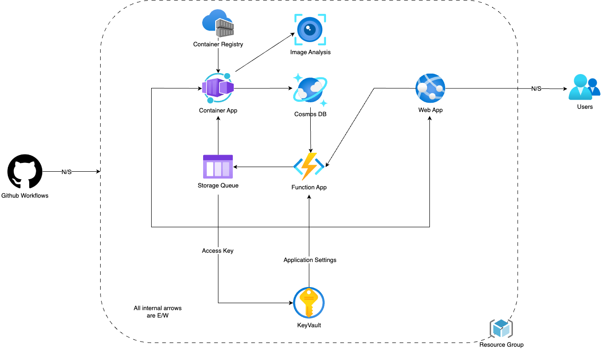

### Components:

**GitHub Workflows**: The workflow triggers actions like testing, building, and deploying applications based on code changes. The N/S arrow indicates that the workflows interactes with developers pushing code.

**Container Registry**: It stores container images that have been created by the build process. These images are ready to be pulled and deployed as containerized applications.

**Container App**: Represents the deployed instances of the application running in containers. API2 in our case. Job is to process images and send JSON to CosmosDB.

**Web App**: The front-end component that users interact with. The N/S arrow here suggests that the Web App communicates with users across the external network. The upload and getImage requests are sent to API1.

**Function App**: A serverless compute service that runs backend code in response to triggers such as HTTP requests, database changes, or queue messages. It interacts with both the Container App and the Web App. API1 in our case. Job is to send uploaded images to queue and blob storage and get image from CosmosDB.

**Users**: The end-users who interact with the Web App over the North-South boundary, typically through the internet.

**Resource Group**: A logical container in cloud platforms used to group together related resources for an application.

**KeyVault**: The KeyVault stores the secrets to be shown and access key to the storage queue. All the applications gain access to the KeyVault using system identity and role assignments.

**Storage Queue**: A storage queue that accepts function app inputs and triggers the container app.

**CosmosDB**: NoSQL datatbase for saving image urls and informations.

**Image Analysis**: API for getting image caption and entities.

E/W Networking Boundaries: All the arrows marked as "East-West" meaning that it is communication between services within the same network, not leaving to the external internet.

### User story:

**User Story 1**: Since I don't have access to BU credentials, I used Microsoft credential instead. I add Microsoft authentication for both Web APP and API1, and add API Permission on Web APP to API1. Then, I set up the request for usable token in Azure CLI. Finally, Web APP will get a token everytime the user sign in through Microsoft credential and will use the bearer token to access API1. Thus, user can secure the access to the library.

**User Story 2**: Use queue and blob storage to store the uploaded image temporarily. As long as the images are successfully uploaded to the storage account(to avoid upload failure), the Web APP will show thumbnails of 'Still processing' to notify user you are free to do next step. Meanwhile, the queue will trigger API2 to process the image and upload them to CosmosDB. Finally, after user refresh the page, he/she can get the uploaded images from database. Because the image processing is behind scenes, user do not need to wait for it.

**User Story 3**: After images are uploadede to the storage account, the Web APP will show default thumbnails of 'Still processing'. After the image is processed, a thumbnail of 200*200 will be stored in blob storage and the corresponding url and inferred caption will be stored in CosmosDB. When the user request the images from the database, it will return the thumbnail as well as the caption. Thus, user can see an image's status and thumbnail on the web page.

### Data Flow:

1. **Code Push & CI/CD Trigger**: Developers push updates to GitHub, initiating the GitHub Workflows.

2. **Build & Image Push**: A Docker image is created and pushed to the Container Registry.

3. **Deployment**: The image is deployed to the Container App, and the Function App is set up to handle backend tasks.

4. **User Interaction**: Users interact with the Web App, which uses the other apps to serve content and perform actions.

5. **Resource Management**: All services are contained within an Azure Resource Group for easy management.

## Getting Started

To begin working with the application:

1. **Permissions**: Ensure access to the GitHub repository, Container Registry, and Azure Resource Group.

2. **Local Development**: Clone the repository and set up your local environment as per the project's guidelines.

3. **Deployment**: Refer to the GitHub Workflows for instructions on the CI/CD processes.

4. **Monitoring & Maintenance**: Post-deployment, use Azure's monitoring services to keep track of application performance and health, updating code and dependencies when necessary.

