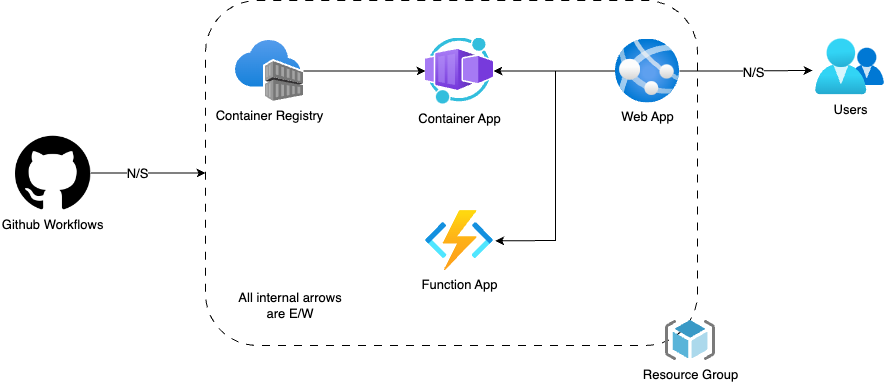

**GitHub Workflows**: The workflow triggers actions like testing, building, and deploying applications based on code changes. The N/S arrow indicates that the workflows interactes with developers pushing code.

**Container Registry**: It stores container images that have been created by the build process. These images are ready to be pulled and deployed as containerized applications.

**Container App**: Represents the deployed instances of the application running in containers. API2 in our case.

**Web App**: The front-end component that users interact with. The N/S arrow here suggests that the Web App communicates with users across the external network.

**Function App**: A serverless compute service that runs backend code in response to triggers such as HTTP requests, database changes, or queue messages. It interacts with both the Container App and the Web App. API1 in our case.

**Users**: The end-users who interact with the Web App over the North-South boundary, typically through the internet.

**Resource Group**: A logical container in cloud platforms used to group together related resources for an application.

E/W Networking Boundaries: All the arrows marked as "East-West" meaning that it is communication between services within the same network, not leaving to the external internet.